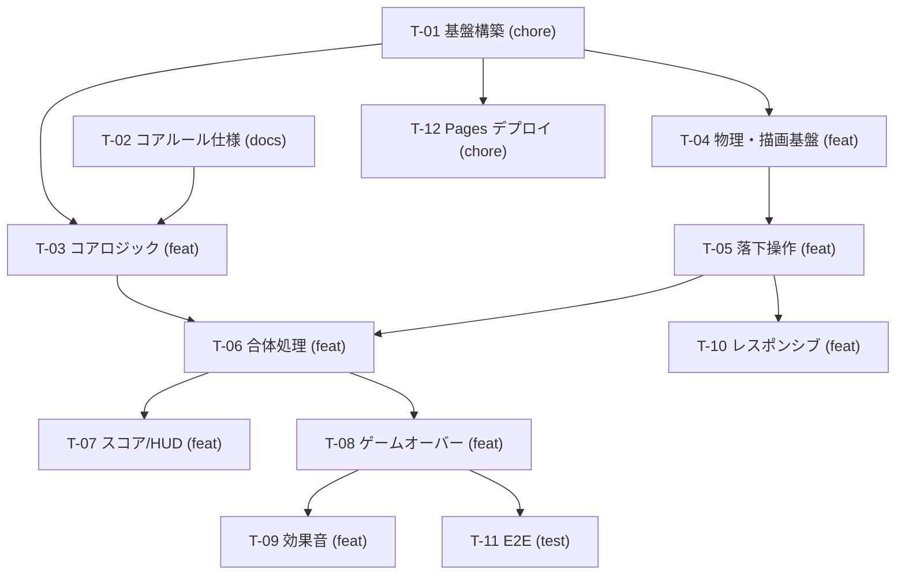

# 作業計画: ブラウザで遊べるスイカゲーム

## メタ情報
- 入力: `docs/internal/requirements-definition-draft/suika-game.md` / `docs/internal/product/product.md` / `docs/internal/product/scope.md` / `docs/internal/architecture/suika-game-structure.md`（いずれも issue #1 を起点に本 PR で新規作成）
- 入力ステージ: A: 要件定義ドラフトのみ（基本設計書は未作成。設計相当の共有事項は「実装の契約点」に集約）
- 粒度プロファイル: feature
- モード: headless（auto-pr-loop daemon から起動。★CP1 / ★CP2 は skill の headless 差分に従い確認なしで続行）
- 作成日: 2026-08-24

## タスク一覧
| task-id | タイトル | type | テンプレ | 根拠ID | 親(task-id) | blocked-by(task-id) | 優先度 | DoD要約 | issue# | node-id |
| --- | --- | --- | --- | --- | --- | --- | --- | --- | --- | --- |
| T-01 | プロジェクト基盤の構築（Vite + TypeScript + Vitest + Playwright） | chore | chore.md | NFR-02,NFR-04,NFR-06 | — | — | high | `npm run dev` / `test` / `build` が通る/lint・format 設定/空の canvas が表示される | [#2](https://github.com/meisterguild/test3/issues/2) | `I_kwDOUCZ_b88AAAABN-RZIQ` |
| T-02 | ゲームコアルールの仕様策定（docs/specs/game-core-rules.md） | docs | spec.md | DT-01,FR-03,FR-04,FR-05,FR-07,FR-08 | — | — | high | 果物テーブル/合体規則/スコア式/出現抽選/ゲームオーバー条件が AC・R 付きで確定 | [#3](https://github.com/meisterguild/test3/issues/3) | `I_kwDOUCZ_b88AAAABN-RZ4Q` |
| T-03 | 果物定義・スコア・合体解決のコアロジック実装 | feat | feat.md | DT-01,FR-03,FR-04,FR-05,FR-08,NFR-05 | — | T-01,T-02 | high | `types`/`fruits`/`score`/`merge`/`spawn` が物理非依存で実装され単体テスト緑 | [#4](https://github.com/meisterguild/test3/issues/4) | `I_kwDOUCZ_b88AAAABN-RanQ` |
| T-04 | 物理シミュレーションと Canvas 描画の基盤 | feat | feat.md | FR-02,UI-01,NFR-01,R-02,R-04,R-05 | — | T-01 | high | 容器/重力/衝突/DPR 対応描画/ゲームループと `Game` イベント API が動作 | [#5](https://github.com/meisterguild/test3/issues/5) | `I_kwDOUCZ_b88AAAABN-RbnA` |
| T-05 | 落下操作とドロップ制御（左右移動・クールダウン・次の果物） | feat | feat.md | FR-01,FR-08,FR-10 | — | T-04 | high | ポインタ/タッチ/キーで狙いが動き、クールダウン内の多重ドロップが起きない | [#6](https://github.com/meisterguild/test3/issues/6) | `I_kwDOUCZ_b88AAAABN-RgNQ` |
| T-06 | 同種果物の合体処理の組み込み | feat | feat.md | FR-03,FR-04,R-01 | — | T-03,T-05 | high | 同 tier 接触で 1 段階上へ合体/スイカ同士は消滅/二重合体しない | [#7](https://github.com/meisterguild/test3/issues/7) | `I_kwDOUCZ_b88AAAABN-RhLQ` |
| T-07 | スコア表示・ハイスコア永続化・HUD | feat | feat.md | FR-05,FR-06,DT-02,UI-01 | — | T-06 | medium | HUD にスコア/ハイスコア/次の果物が出る、リロードでハイスコア保持 | [#8](https://github.com/meisterguild/test3/issues/8) | `I_kwDOUCZ_b88AAAABN-Rh6Q` |
| T-08 | ゲームオーバー判定・モーダル・リスタート / ポーズ | feat | feat.md | FR-07,FR-09,UI-02,R-03 | — | T-06 | medium | 猶予時間付きデッドライン判定/モーダル表示/リトライで初期化 | [#9](https://github.com/meisterguild/test3/issues/9) | `I_kwDOUCZ_b88AAAABN-Ri3A` |
| T-09 | 効果音とミュート切替 | feat | feat.md | FR-11 | — | T-08 | low | drop/merge/gameover に音が鳴る、ミュートが永続化、音源欠損でも継続 | [#10](https://github.com/meisterguild/test3/issues/10) | `I_kwDOUCZ_b88AAAABN-RnQg` |
| T-10 | レスポンシブ / タッチ最適化（スマホ縦持ち・PC） | feat | feat.md | UI-03,R-04 | — | T-05 | medium | 375×667 と 1280×800 でスクロールなしに全体が収まりタッチで遊べる | [#11](https://github.com/meisterguild/test3/issues/11) | `I_kwDOUCZ_b88AAAABN-RoRA` |
| T-11 | E2E テストシナリオの整備（Playwright） | test | test-design.md | NFR-04,AC-01,AC-02,AC-03,AC-04,AC-05,AC-06 | — | T-08 | medium | AC-01〜06 に対応する spec が CI で緑（未実装分は `test.fixme`） | [#12](https://github.com/meisterguild/test3/issues/12) | `I_kwDOUCZ_b88AAAABN-Ro8A` |
| T-12 | GitHub Pages への静的デプロイ | chore | chore.md | NFR-03 | — | T-01 | medium | Actions で build → Pages 公開、公開 URL で遊べる | [#13](https://github.com/meisterguild/test3/issues/13) | `I_kwDOUCZ_b88AAAABN-Rpwg` |

- `issue#` / `node-id` 列は起票フェーズで埋める（**本計画は起票完了済み**）。空の `issue#` を持つ行だけが
  再実行時の起票対象（冪等の真理ソース）なので、全行埋まっている本計画を再実行しても重複起票は起きない。
- 起票順は依存トポロジ順であり、task-id 順（T-01→T-12）と issue 番号順（#2→#13）が一致している。
- 取りまとめ親は作らない（親列は全て `—`）。issue #1 が実質のマスターであり、本 PR のマージで close されるため、
  子を持つ親 issue を新規に作ると auto-pr-loop の epic base 推論（`auto_epic_base`）と自動マージ対象の判定に
  影響する。トレーサビリティは各 issue 本文の `Part-of: #1` と本ファイルで担保する。

## 依存グラフ



- 矢印は blocked-by（矢印の元が先行タスク）。親子（subgraph）は本計画では使わない。
- 循環なし。トポロジ順の一例: T-01 → T-02 → T-04 → T-03 → T-05 → T-12 → T-06 → T-10 → T-07 → T-08 → T-11 → T-09。

## カバレッジ表（要件ID → task-id）

| 根拠ID | 対応 task-id | 備考 |
| --- | --- | --- |
| FR-01 | T-05 | 落下位置の指定とドロップ |
| FR-02 | T-04 | 物理挙動 |
| FR-03 | T-03, T-06 | ロジック（T-03）と物理への組み込み（T-06） |
| FR-04 | T-03, T-06 | スイカ同士の消滅 |
| FR-05 | T-03, T-07 | 計算（T-03）と表示（T-07） |
| FR-06 | T-07 | ハイスコア永続化 |
| FR-07 | T-08 | ゲームオーバー判定 |
| FR-08 | T-03, T-05 | 抽選（T-03）とプレビュー表示（T-05 / HUD は T-07） |
| FR-09 | T-08 | リスタート / ポーズ |
| FR-10 | T-05 | ドロップクールダウン |
| FR-11 | T-09 | 効果音・ミュート |
| UI-01 | T-04, T-07 | 容器・デッドライン描画（T-04）と HUD（T-07） |
| UI-02 | T-08 | ゲームオーバーモーダル |
| UI-03 | T-10 | レスポンシブ |
| DT-01 | T-02, T-03 | 仕様確定（T-02）と実装（T-03） |
| DT-02 | T-07 | localStorage スキーマ |
| NFR-01 | T-04 | 60fps 目標（sleeping 有効化） |
| NFR-02 | T-01 | 対応ブラウザ（ビルドターゲット設定） |
| NFR-03 | T-12 | 静的配信 |
| NFR-04 | T-01, T-11 | テスト基盤（T-01）と E2E シナリオ（T-11）。単体テストは各 feat issue の DoD に含む |
| NFR-05 | T-03 | ルールを物理非依存の純関数に |
| NFR-06 | T-01 | 依存最小化・追加時の理由記録 |
| AC-01〜AC-06 | T-11 | E2E テストで検証。ID の最終確定も T-11 |
| R-01 | T-06 | 二重合体の防止 |
| R-02 | T-04 | 物理パラメータの定数集約 |
| R-03 | T-08 | 猶予時間付き判定 |
| R-04 | T-04, T-10 | DPR 対応 |
| R-05 | T-04 | sleeping 有効化 |

- 未 issue 化の根拠 ID: **なし**（全 ID が最低 1 タスクに対応）。
- 前提 A-01〜A-04（推測の明示）は要件ではないためカバレッジ対象外。覆った場合は該当 issue を修正する。

## backlog.md 追記

起票済みタスクは [backlog.md](./backlog.md) に全 12 行を反映済み（列は既存の `ID / Task / Feature / Priority / Status` を維持）。

## relationship 配線結果

- 親子（sub-issue）: **配線しない**（取りまとめ親を作らない方針。上記「タスク一覧」の注記参照）
- blocked-by: GitHub ネイティブの依存関係として `addBlockedBy` で配線済み（全 12 件成功）

| blocked | blocked-by | 状態 |
| --- | --- | --- |
| T-03 (#4) | T-01 (#2), T-02 (#3) | ✅ |
| T-04 (#5) | T-01 (#2) | ✅ |
| T-05 (#6) | T-04 (#5) | ✅ |
| T-06 (#7) | T-03 (#4), T-05 (#6) | ✅ |
| T-07 (#8) | T-06 (#7) | ✅ |
| T-08 (#9) | T-06 (#7) | ✅ |
| T-09 (#10) | T-08 (#9) | ✅ |
| T-10 (#11) | T-05 (#6) | ✅ |
| T-11 (#12) | T-08 (#9) | ✅ |
| T-12 (#13) | T-01 (#2) | ✅ |

- 補助として各 issue 本文の「関連」に `Part-of: #1` / `Depends on #N` をテキストでも残している ✅
- auto-pr-loop は「GitHub ネイティブの依存関係 (blocked by) が未解決の issue」を pick から除外するため、
  この配線がそのまま daemon の実行順序制御として機能する。

## 起票後の運用（重要）

起票した 12 issue には **`status:queued` を付けていない**。issue #1 の依頼は「まずは計画して、実装の Issue を
作成して」であり、計画のレビュー前に実装 daemon が全件を走らせることは依頼の範囲外と判断した。

計画に合意できたら、次のコマンドで daemon の処理対象に入れる（blocked-by が未解決の issue は daemon が
自動で見送るため、全件まとめて queue しても依存順に処理される）。

```bash
for n in 2 3 4 5 6 7 8 9 10 11 12 13; do
  gh issue edit "$n" --add-label "status:queued"
done
```

段階的に進めたい場合は、依存の先頭（#2 = T-01 / #3 = T-02）だけを queue する。
