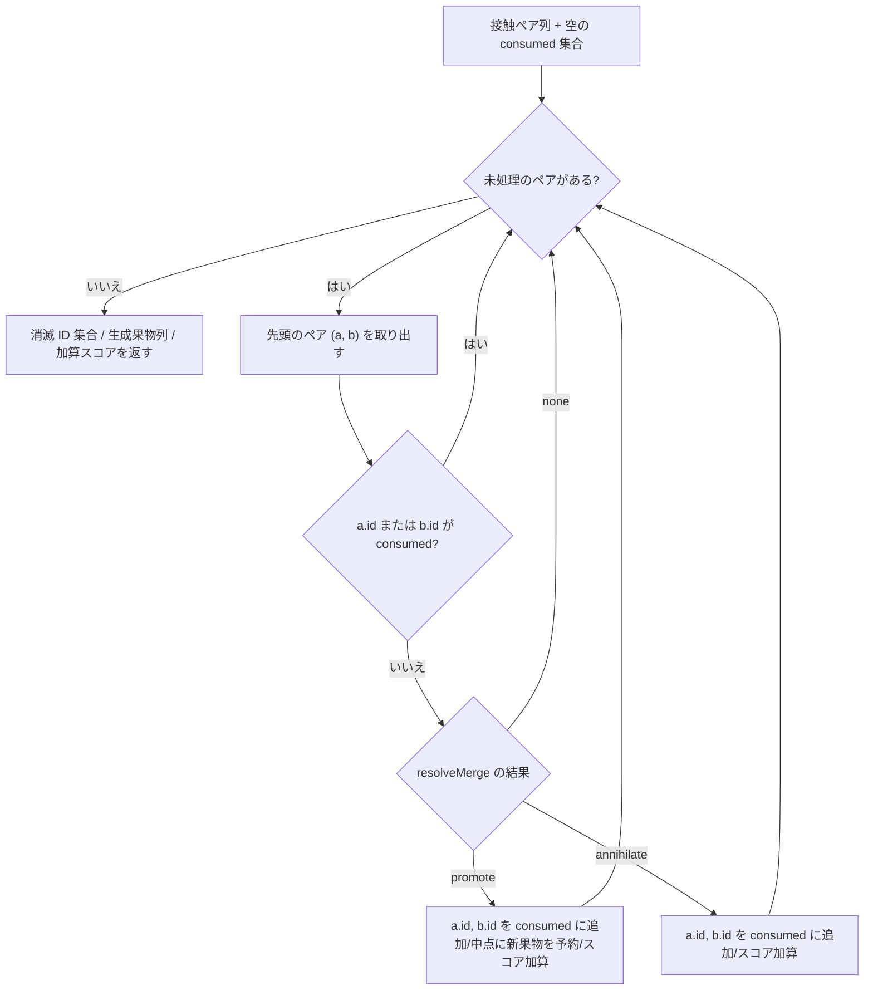
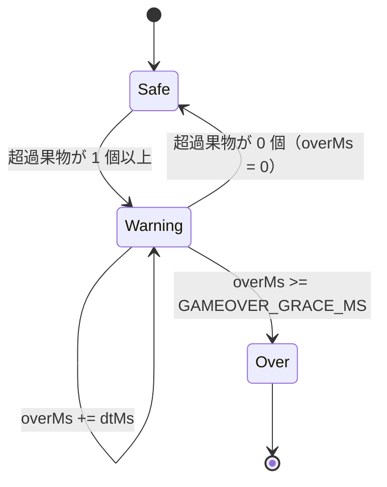

# ゲームコアルール（果物・合体・スコア・出現抽選・ゲームオーバー）

- spec-name: `game-core-rules`（テスト側のラベル prefix。例: `[game-core-rules:AC-2]`）
- 起点 issue: [#3](https://github.com/meisterguild/test3/issues/3)（Part-of [#1](https://github.com/meisterguild/test3/issues/1)）
- 根拠 ID: DT-01 / FR-03 / FR-04 / FR-05 / FR-07 / FR-08（[要件定義ドラフト](../internal/requirements-definition-draft/suika-game.md)）
- 実装の契約点: [suika-game-structure.md](../internal/architecture/suika-game-structure.md)

## 真理ソースの境界（重要）

本ファイルと実装の契約点ドキュメントで役割を分ける。**どちらが正かを先に固定する**（数値の二重管理による乖離を防ぐため。R-4）。

| 対象 | 真理ソース |
| --- | --- |
| 果物定義テーブル（tier / 表示名 / 半径 / 色）・抽選重み | **本 spec**（契約点 §4 は本 spec の要約） |
| 合体規則・スコア式・出現抽選規則・ゲームオーバー判定規則 | **本 spec**（契約点 §6 は本 spec の要約） |
| 盤面・物理・タイミング定数（`DEADLINE_Y` / `GAMEOVER_GRACE_MS` / 重力・摩擦など） | **契約点 §5**（本 spec は参照のみ。値をここに複製しない） |
| 共有型（`FruitTier` / `FruitDef` / `MergeResult`）・イベント契約 | **契約点 §3 / §7** |

本 spec とルール系の実装・テストが食い違った場合は本 spec を正とする。ルールを変える場合は本 spec を先に更新し、同一 PR で契約点 §4 / §6 の要約を追随させる。

## Purpose

「どの接触で何が起きて、何点入り、いつゲームが終わるか」を一意に定める。コアロジック実装（[#4](https://github.com/meisterguild/test3/issues/4)）・合体処理の組み込み（[#7](https://github.com/meisterguild/test3/issues/7)）・ゲームオーバー判定（[#9](https://github.com/meisterguild/test3/issues/9)）・テスト設計（[#12](https://github.com/meisterguild/test3/issues/12)）が、この 1 ファイルだけを参照して同じ挙動に到達できる状態を作る。

## 対象範囲

- 触るファイル / インターフェース
  - `src/game/types.ts` — 共有型（契約点 §3 の再掲はしない）
  - `src/game/fruits.ts` — 果物定義テーブル `FRUITS` / 抽選重み `SPAWN_WEIGHTS`（DT-01）
  - `src/game/score.ts` — `mergeScore(tier)` / `WATERMELON_ANNIHILATE_SCORE`（FR-05）
  - `src/game/merge.ts` — 接触 1 組の解決 `resolveMerge` / フレーム単位の解決 `resolveMergeBatch`（FR-03 / FR-04）
  - `src/game/spawn.ts` — 出現抽選 `drawFruitTier(rng)` と先読みキュー（FR-08）
  - `src/game/gameover.ts` — デッドライン超過の継続判定（FR-07）
- スコープ外（本 spec では決めない）
  - 物理パラメータのプレイフィール調整、容器・壁の形状、描画・DPR 対応（契約点 §5 / #5）
  - 入力操作・ドロップクールダウン（#6）、HUD / モーダル / 効果音 / 永続化（#8 / #9 / #10）
  - 果物 1 個 1 個の物理ボディ生成・削除の実装手段（Matter.js の API 選択は #7 の裁量）

## User Interaction

プレイヤーは本 spec のルールを直接操作しない。観測できるのは次の 4 点のみ。

1. 「次の果物」として、tier 0〜4 のいずれかが常に 1 個だけ予告される。
2. 落とした果物が同じ種類の果物に触れると、1 段階上の果物 1 個に変わり、スコアが増える。
3. スイカ同士が触れると両方消え、まとまったスコアが入る（スイカより上は存在しない）。
4. 果物がデッドラインより上にはみ出した状態が続くとゲームオーバーになる。線を一瞬横切るだけでは終わらない。

## Inputs

| 入力 | 型・制約 | 供給元 |
| --- | --- | --- |
| 接触ペア列 | `Array<{ a: FruitRef; b: FruitRef }>`。`FruitRef` は `{ id: number; tier: FruitTier; x: number; y: number }` | 物理層（`physics.ts` の衝突イベント）を 1 フレーム分まとめたもの |
| 乱数源 | `rng: () => number`。契約は `0 <= rng() < 1` | 既定は `Math.random`。テストは固定値関数を注入する（NFR-05） |
| フレーム経過時間 | `dtMs: number`（`0 <= dtMs`） | ゲームループ |
| 盤面スナップショット | `Array<{ id: number; tier: FruitTier; y: number; radius: number; landed: boolean }>` | 物理層。`landed` は「ドロップ後に一度でも他の物体（壁・床・果物）と接触したか」。`radius` は R-E の上端判定（`y - radius`）に使う |
| ゲーム状態 | `GameStatus`（契約点 §3） | `game.ts` の状態機械 |

座標系は契約点 §5 の論理座標系 480×720。**y は下方向が正**（canvas 慣習）。したがって「デッドラインより上」は `y` が小さい側を指す。

## Outputs

| 出力 | 型 | 意味 |
| --- | --- | --- |
| 合体結果 | `MergeResult`（契約点 §3） | `none` / `promote`（tier + score）/ `annihilate`（score） |
| 生成位置 | `{ x: number; y: number }` | `promote` のときの新果物の中心座標 |
| 消滅果物 ID 集合 | `number[]` | そのフレームで盤面から取り除く果物 |
| 加算スコア | `number`（0 以上の整数） | そのフレームの合体スコアの総和 |
| ゲームオーバー判定 | `{ isOver: boolean; overMs: number }` | `overMs` はデッドライン超過の継続時間（ミリ秒） |

副作用として `merge` / `scorechange` / `gameover` イベント（契約点 §7）が発火するが、発火の実装責務は `game.ts` にある。

## Rules（ルール・ロジック）

### R-A. 果物定義テーブル（DT-01）

`FRUITS: readonly FruitDef[]` として `index === tier` で保持する。**tier は 0〜10 の 11 段階で固定**し、増減しない。

| tier | label | radius | color | 抽選重み |
| --- | --- | --- | --- | --- |
| 0 | さくらんぼ | 14 | `#d63c3c` | 5 |
| 1 | いちご | 19 | `#e8556d` | 4 |
| 2 | ぶどう | 25 | `#8e5fb0` | 3 |
| 3 | デコポン | 31 | `#f2a03d` | 2 |
| 4 | かき | 38 | `#e8762c` | 1 |
| 5 | りんご | 46 | `#d93a3a` | — |
| 6 | なし | 55 | `#d9d95e` | — |
| 7 | もも | 64 | `#f2a3b3` | — |
| 8 | パイナップル | 74 | `#e0c341` | — |
| 9 | メロン | 85 | `#9ad14b` | — |
| 10 | スイカ | 98 | `#3f8f4a` | — |

- `MAX_TIER = 10`、`SPAWNABLE_MAX_TIER = 4`、`SPAWN_WEIGHTS = [5, 4, 3, 2, 1]`（index === tier）。
- 半径は tier に対して**厳密単調増加**であること。色・半径の微調整は許容するが、単調性・段階数（11）・抽選範囲（0〜4）は仕様として固定する。
- 合体スコアはテーブルの列として持たず、R-C の式から導出する（同じ値を 2 箇所に置かないため）。

### R-B. 合体規則（FR-03 / FR-04）

接触 1 組 `(a, b)` に対する解決 `resolveMerge(a.tier, b.tier)`:

| 条件 | 結果 |
| --- | --- |
| `a.tier !== b.tier` | `{ kind: 'none' }` |
| `a.tier === b.tier` かつ `tier < 10` | `{ kind: 'promote', tier: tier + 1, score: mergeScore(tier + 1) }` |
| `a.tier === b.tier === 10` | `{ kind: 'annihilate', score: WATERMELON_ANNIHILATE_SCORE }` |

- `promote` のとき、元の 2 個は消滅し、新果物 1 個が**接触した 2 個の中心の中点**に生成される（盤面の果物数は 1 減る）。
  `x = (a.x + b.x) / 2`、`y = (a.y + b.y) / 2`。
- 新果物の**初速・角速度は 0**、回転角は 0 とする（元の 2 個の運動量は引き継がない）。決定論を優先し、生成位置以外の初期条件を物理履歴に依存させない。
- `annihilate` のとき、元の 2 個は消滅し、新果物は生成しない（**tier 11 を作らない**）。
- 空中での接触も合体対象とする（着地は合体の条件ではない。`landed` は R-E のゲームオーバー判定にのみ使う）。

### R-C. スコア（FR-05）

```
mergeScore(t) = t * (t + 1) / 2      // t = 1..10（生成される果物の tier）
WATERMELON_ANNIHILATE_SCORE = 100
```

| 生成される果物 | tier | スコア |
| --- | --- | --- |
| いちご | 1 | 1 |
| ぶどう | 2 | 3 |
| デコポン | 3 | 6 |
| かき | 4 | 10 |
| りんご | 5 | 15 |
| なし | 6 | 21 |
| もも | 7 | 28 |
| パイナップル | 8 | 36 |
| メロン | 9 | 45 |
| スイカ | 10 | 55 |

- 累計スコアは合体スコアの総和。**単調非減少**であり、減点は存在しない。ドロップ・着地・ゲームオーバーではスコアが動かない。
- `mergeScore(0)` は定義しない（tier 0 は合体で生成されない）。呼ばれた場合の扱いは Edge Cases に定める。
- スコアは常に非負整数。式が三角数のため、浮動小数の丸め誤差は発生しない。

### R-D. フレーム単位の合体解決（R-1 / R-5 対策）

1 フレームに複数の接触ペアが届くため、**消費済み ID を持ちながら入力順に畳み込む**。これで同一果物が 1 フレームで 2 回合体することを防ぐ（＝スコアの二重計上を防ぐ）。



- **そのフレームで生成された果物は、同じフレームの後続ペア判定に参加しない。** 連鎖合体は次フレーム以降に成立する（1 フレーム内での無限連鎖を構造的に排除する）。
- 物理ボディの削除・生成は、ペア列の畳み込みが**すべて終わった後**にまとめて適用する（走査中に盤面を変更しない）。
- 同一ペアが同じフレームに重複して届いても、2 回目は `consumed` 判定で落ちるため成立しない。
- 3 個以上の同 tier が同時接触した場合、入力順に 1 組だけ成立し、余った 1 個はそのまま残る（次フレームで再判定される）。
- 入力順は物理層のイベント到着順に従う。純関数層は「渡された順序に対して決定論的」であることだけを保証する（テストはペア列を直接組んで検証する）。

### R-E. ゲームオーバー判定（FR-07 / R-2 対策）

デッドライン超過は「瞬間」ではなく「継続」で判定する。

- **超過している果物**の定義: `landed === true` かつ `y - radius < DEADLINE_Y`（果物の上端がデッドラインより上にある）。
  - 等号（`y - radius === DEADLINE_Y`、線にちょうど触れている）は超過**ではない**。
  - `landed === false`（ドロップ直後の落下中）の果物は判定対象外。`DROP_Y`（60）は `DEADLINE_Y`（120）より上にあるため、この除外がないと毎回ドロップ即ゲームオーバーになる。
  - ドロップ待機中（まだ盤面に投入されていない）果物は盤面スナップショットに含めない。
  - 合体で生成された果物は `landed = true` として扱う（既に積み上がった 2 個から生まれるため）。
- **継続時間の更新**（毎フレーム、`status === 'playing'` のときだけ）:
  - 超過している果物が 1 個以上 → `overMs += dtMs`
  - 超過している果物が 0 個 → `overMs = 0`（リセット）
  - `overMs >= GAMEOVER_GRACE_MS` → ゲームオーバー確定
- `status !== 'playing'`（`ready` / `paused` / `over`）のフレームでは `overMs` を加算しない（ポーズ中に時間が進んでゲームオーバーになるのを防ぐ。R-6）。
- リスタート時は `overMs = 0` に初期化する。
- ゲームオーバーは一方通行。確定後に超過が解消しても `playing` へは戻らない。



### R-F. 出現抽選（FR-08）

- 抽選対象は tier 0〜4 の 5 種のみ。`SPAWN_WEIGHTS = [5, 4, 3, 2, 1]`（合計 `TOTAL_WEIGHT = 15`）による**重み付き抽選**。
- 選択規則: `r = rng() * TOTAL_WEIGHT` としたとき、`cumulative[t] > r` を満たす**最小の** `t` を選ぶ。

| tier | 重み | 累積 | 選択される r の範囲 | 確率 |
| --- | --- | --- | --- | --- |
| 0 | 5 | 5 | `0 <= r < 5` | 33.33% |
| 1 | 4 | 9 | `5 <= r < 9` | 26.67% |
| 2 | 3 | 12 | `9 <= r < 12` | 20.00% |
| 3 | 2 | 14 | `12 <= r < 14` | 13.33% |
| 4 | 1 | 15 | `14 <= r < 15` | 6.67% |

- **先読みキュー**: 「今ドロップ待機している果物」と「次の果物」の 2 個を常に確定させておく（FR-08 の予告表示のため）。
  - ゲーム開始 / リスタート時に 2 回抽選する。
  - ドロップが成立した時点で `next` を `current` に繰り上げ、新たに 1 回抽選して `next` を埋める。
  - 抽選はドロップ成立時のみ発生する（クールダウンで弾かれた入力では抽選しない）。
- 抽選は直前の結果に依存しない（独立試行）。同じ tier が連続することを許容する。

## Edge Cases

| # | ケース | 期待挙動 |
| --- | --- | --- |
| E-1 | 異なる tier の接触 | `{ kind: 'none' }`。スコア 0、消滅なし |
| E-2 | 果物と壁・床の接触 | 合体判定の入力に含めない（物理層で除外） |
| E-3 | 同 tier 3 個以上の同時接触 | 入力順に 1 組だけ成立。余りは残る（R-D） |
| E-4 | 同一ペアが 1 フレームに重複して届く | 2 回目以降は `consumed` により不成立。スコアは 1 回だけ |
| E-5 | 消滅済み ID を含むペアが届く | `consumed` 判定で不成立。例外を投げない |
| E-6 | スイカ 3 個が同時接触 | 1 組だけ消滅（100 点）。3 個目は残る |
| E-7 | 落下中の果物同士が空中で接触 | 通常どおり合体する（R-B） |
| E-8 | `mergeScore(0)` / 範囲外 tier での呼び出し | 契約違反。開発時に検知できるよう 0 を返さず例外を投げる（`RangeError`）。**呼び出し側が範囲を保証する** |
| E-9 | `rng()` が `1` 以上 / 負 / `NaN` を返す | `r` を `[0, TOTAL_WEIGHT)` にクランプして抽選する。`NaN` は tier 0 とみなす。例外は投げない（ゲームを止めない） |
| E-10 | 盤面に果物が 0 個 | 超過果物 0 個として `overMs = 0`。ゲームオーバーにしない |
| E-11 | `dtMs` が 0 または極端に大きい（タブ復帰直後など） | 0 は加算なし。大きい値はそのまま加算されるため、呼び出し側でフレーム時間を上限クランプする（実装は #5 の責務） |
| E-12 | 合体で生成された果物が `DEADLINE_Y` より上に出る | `landed = true` のため即座に超過カウントを開始する（意図した挙動。猶予時間内に崩れれば継続） |
| E-13 | ゲームオーバー確定後に接触イベントが届く | 合体解決を行わない（`status !== 'playing'` のフレームではルールを評価しない） |
| E-14 | 容器外へ抜けた果物 | 本 spec の対象外。物理層（#5）で検知・除去する |

権限・認証に関わる異常系（未認証・権限不足・他ユーザーのリソース）は本ゲームに存在しない（NFR-03 / DT-02: バックエンドなし・個人情報なし）。

## Acceptance Criteria

受け入れ条件は `game-core-rules:AC-N`。**権限系 AC は該当なし**（認証・認可・マルチユーザーの概念を持たないローカル完結ゲームのため）。境界値・入力バリエーションの網羅は [#12](https://github.com/meisterguild/test3/issues/12) のテスト設計側で AC-ID に紐づけて展開する。

### AC-1 正常系: 果物テーブルが tier 0〜10 で一意に定まる
- 前提（Given）: `FRUITS` を import した状態
- 操作（When）: テーブル全体を走査する
- 期待（Then）: 要素数は 11。全要素で `FRUITS[i].tier === i`、`label` は非空、`color` は CSS カラー文字列、`radius` は tier に対して厳密単調増加（14 → 98）。R-A の表と完全一致する
- test: `tests/unit/fruits.test.ts > [game-core-rules:AC-1]`

### AC-2 正常系: 同 tier（0〜9）の接触は 1 段階上へ合体する
- 前提（Given）: 同じ tier `t`（`0 <= t <= 9`）の果物 2 個が接触している
- 操作（When）: 合体を解決する
- 期待（Then）: 結果は `{ kind: 'promote', tier: t + 1, score: mergeScore(t + 1) }`。元の 2 個は消滅 ID に含まれ、新果物 1 個が 2 個の中心の中点に初速 0 で生成される（盤面の果物数は 1 減る）
- test: `tests/unit/merge.test.ts > [game-core-rules:AC-2]`

### AC-3 正常系: 合体スコアが `t * (t + 1) / 2` で決まる
- 前提（Given）: 生成される果物の tier `t`（`1 <= t <= 10`）
- 操作（When）: `mergeScore(t)` を呼ぶ
- 期待（Then）: R-C の表と一致する（1 / 3 / 6 / 10 / 15 / 21 / 28 / 36 / 45 / 55）。戻り値は常に非負整数
- test: `tests/unit/score.test.ts > [game-core-rules:AC-3]`

### AC-4 正常系: スイカ同士は両方消滅し 100 点が入る
- 前提（Given）: tier 10 の果物 2 個が接触している
- 操作（When）: 合体を解決する
- 期待（Then）: 結果は `{ kind: 'annihilate', score: 100 }`。両方が消滅 ID に含まれ、**新果物は生成されない**（tier 11 は存在しない）
- test: `tests/unit/merge.test.ts > [game-core-rules:AC-4]`

### AC-5 異常系: 異なる tier の接触では何も起きない
- 前提（Given）: tier が異なる果物 2 個が接触している（隣接 tier を含む）
- 操作（When）: 合体を解決する
- 期待（Then）: 結果は `{ kind: 'none' }`。加算スコア 0、消滅 ID 空、生成なし
- test: `tests/unit/merge.test.ts > [game-core-rules:AC-5]`

### AC-6 異常系: 1 フレーム内で同一果物が二重に合体しない
- 前提（Given）: 同 tier の果物 A / B / C が同時接触し、ペア列 `[(A,B), (B,C)]` が 1 フレームで届く
- 操作（When）: フレーム単位の合体解決を行う
- 期待（Then）: 成立するのは `(A,B)` の 1 組のみ。加算スコアは 1 回分、消滅 ID は `A`・`B` の 2 件、`C` は盤面に残る。同一ペアが重複して届いた場合もスコアは 1 回分（R-1 の防止）
- test: `tests/unit/merge.test.ts > [game-core-rules:AC-6]`

### AC-7 正常系: 同フレームに生成された果物は連鎖合体しない
- 前提（Given）: 同 tier のペア 2 組が同時合体し、生成される 2 個が互いに同 tier になる状況
- 操作（When）: 1 フレーム分の合体解決を行う
- 期待（Then）: そのフレームの加算スコアは 2 組分のみ。生成された 2 個の合体は同じフレームでは成立しない（次フレーム以降に持ち越される）
- test: `tests/unit/merge.test.ts > [game-core-rules:AC-7]`

### AC-8 正常系: 出現抽選が tier 0〜4 の重み付きで決定論的に行われる
- 前提（Given）: 固定値を返す `rng` を注入した状態
- 操作（When）: `rng()` が `0` / `0.3` / `0.34` / `0.6` / `0.8` / `0.9` / `0.99` を返す各ケースで抽選する
- 期待（Then）: R-F の累積表に従い、`r = rng() * 15` の区間に対応する tier が返る（境界 `r = 5, 9, 12, 14` は上位側の tier）。結果は常に 0〜4
- test: `tests/unit/spawn.test.ts > [game-core-rules:AC-8]`

### AC-9 異常系: 契約外の乱数値でも抽選結果が範囲を外れない
- 前提（Given）: `1`・`1.5`・`-0.1`・`NaN` を返す `rng` を注入した状態
- 操作（When）: 抽選する
- 期待（Then）: 例外を投げず、結果は必ず tier 0〜4 に収まる（`1` 以上は tier 4、負値と `NaN` は tier 0）
- test: `tests/unit/spawn.test.ts > [game-core-rules:AC-9]`

### AC-10 正常系: 先読みキューが常に 2 個を保持する
- 前提（Given）: ゲーム開始直後（または リスタート直後）
- 操作（When）: `current` / `next` を確認し、ドロップを 1 回成立させる
- 期待（Then）: 開始時点で `current` / `next` の 2 個が確定している。ドロップ後、旧 `next` が `current` になり、`next` に新しい抽選結果が入る。いずれも tier 0〜4
- test: `tests/unit/spawn.test.ts > [game-core-rules:AC-10]`

### AC-11 正常系: デッドライン超過が猶予時間継続するとゲームオーバーになる
- 前提（Given）: `landed === true` で `y - radius < DEADLINE_Y` の果物が 1 個以上あり、`status === 'playing'`
- 操作（When）: 超過状態のまま `GAMEOVER_GRACE_MS` 以上の時間分フレームを進める
- 期待（Then）: 累積 `overMs` が `GAMEOVER_GRACE_MS` に達した時点でゲームオーバーが確定する。それ未満のフレームでは確定しない（境界: `GAMEOVER_GRACE_MS - 1` では未確定、`GAMEOVER_GRACE_MS` で確定）
- test: `tests/unit/gameover.test.ts > [game-core-rules:AC-11]`

### AC-12 異常系: 落下中・猶予内で解消した超過ではゲームオーバーにならない
- 前提（Given）: `landed === false` の落下中の果物が `DEADLINE_Y` より上にある状態、および超過が猶予未満で解消する状態
- 操作（When）: それぞれフレームを進める
- 期待（Then）: 落下中の果物は超過として数えず `overMs` は 0 のまま。猶予未満で超過が解消した場合は `overMs` が 0 にリセットされ、再び超過してもカウントは 0 から始まる（R-2 / R-3 の防止）。`status !== 'playing'`（ポーズ中）のフレームでは `overMs` が加算されない
- test: `tests/unit/gameover.test.ts > [game-core-rules:AC-12]`

### AC-13 正常系: 累計スコアが合体スコアの総和として単調非減少に増える
- 前提（Given）: 累計スコア 0 の初期状態
- 操作（When）: 任意の合体列（`promote` と `annihilate` の混在）を順に適用する
- 期待（Then）: 累計スコアは各合体スコアの総和と一致し、減少するフレームが存在しない。ドロップ・着地・ゲームオーバーではスコアが変化しない
- test: `tests/unit/score.test.ts > [game-core-rules:AC-13]`

## 要件レベル受け入れ条件（AC-01〜AC-06）

要件定義ドラフトの AC-01〜AC-06（通しシナリオ）は**本節で確定**させ、E2E（Playwright）で検証する（[#12](https://github.com/meisterguild/test3/issues/12)）。ルール単位の AC（前節）と ID が衝突しないよう、次のように読み分ける。

| ID の形 | 対象 | 実行系 | テスト名の prefix |
| --- | --- | --- | --- |
| `AC-1`〜`AC-13`（ゼロ埋めなし） | ルール単位（純関数） | Vitest | `[game-core-rules:AC-N]` |
| `AC-01`〜`AC-06`（ゼロ埋め） | 通しシナリオ（実ブラウザ） | Playwright | `[AC-0N]` |

E2E は物理シミュレーションを含むため、境界値の網羅は前節の単体テスト側に置き、本節は「プレイヤーに見える結果が出るか」だけを見る（同じ判定を 2 系統で二重に網羅しない）。AC ↔ テストの対応表は [test-scenarios/suika-game-e2e.md](../deliverables/test-scenarios/suika-game-e2e.md)。

### AC-01 初回アクセスでゲーム画面が表示され、次の果物が見える（FR-08 / UI-01）
- 前提（Given）: 保存済みデータのない状態でトップページを開く
- 操作（When）: 何も操作しない
- 期待（Then）: 盤面（`game-canvas`）・HUD・操作バーが表示され、スコアは `0`、ゲームオーバーモーダルは出ていない。次の果物が抽選対象（tier 0〜4）の**名前**で予告されている（本 spec AC-8 / AC-10 の結果が画面に出ている）
- test: `tests/e2e/gameplay.spec.ts > [AC-01]`

### AC-02 狙いを左右に動かしてドロップすると、果物が落ちて容器内で静止する（FR-01 / FR-02）
- 前提（Given）: ゲーム開始直後（盤面に果物が 0 個）
- 操作（When）: 盤面上でポインタを左 → 右へ動かし、任意の位置でドロップする
- 期待（Then）: 狙いがポインタに追従し、落とした果物は容器の内側に収まったまま床の上で静止する（落とした位置から大きく離れない）。静止の判定は待機時間ではなく物理側の sleeping で行う
- test: `tests/e2e/gameplay.spec.ts > [AC-02]`

### AC-03 同種果物を接触させると 1 段階上へ合体し、スコアが増える（FR-03 / FR-05）
- 前提（Given）: ゲーム開始直後
- 操作（When）: 同じ tier の果物を同じ列へ 2 個落として接触させる
- 期待（Then）: 2 個が 1 段階上の果物 1 個になり（盤面の果物数は 1 減る）、スコアが R-C の値ぶん増えて HUD に反映される（本 spec AC-2 / AC-3 / AC-13 の結果が画面に出ている）
- test: `tests/e2e/gameplay.spec.ts > [AC-03]`

### AC-04 容器を満杯にするとゲームオーバーモーダルが表示される（FR-07 / UI-02）
- 前提（Given）: プレイ中（`status === 'playing'`）
- 操作（When）: 容器の空いている高さを埋め続け、デッドラインより上に果物が留まる状態を作る
- 期待（Then）: 超過が `GAMEOVER_GRACE_MS` 続いた時点で状態が `over` になり、ゲームオーバーモーダルに最終スコアとハイスコアが表示される（本 spec AC-11 / AC-12 の結果が画面に出ている）
- test: `tests/e2e/gameplay.spec.ts > [AC-04]`

### AC-05 リロード後もハイスコアが保持されている（FR-06）
- 前提（Given）: 保存済みハイスコアが 0 の状態
- 操作（When）: 合体でスコアを増やしてからページをリロードする
- 期待（Then）: 現在スコアは `0` に戻り、ハイスコアは合体で得た値のまま表示される（保存はゲームオーバーを待たない）
- test: `tests/e2e/gameplay.spec.ts > [AC-05]`

### AC-06 375×667 の viewport でプレイエリア全体が収まりタッチでプレイできる（UI-03）
- 前提（Given）: viewport 375×667（スマホ縦持ち相当）
- 操作（When）: 盤面をタッチしてドロップする
- 期待（Then）: 縦横ともスクロールなしに盤面・HUD・操作バーが 1 画面へ収まり、盤面はビューポートの内側に完全に入っている。実解像度は「CSS 表示サイズ × `devicePixelRatio`」（R-04）。タッチ操作で果物が落ちる
- test: `tests/e2e/responsive.spec.ts > [AC-06]`

### 潜在リスクの E2E 観測

`R-1`（1 フレーム内の多重合体によるスコア二重計上）は単体テストで境界を固定しつつ、実ブラウザでも同時接触の盤面を組んで観測する（テスト名の prefix は issue #12 の ToDo に合わせて `[R-01]`。指すリスクは本 spec の R-1 と同一）。

- test: `tests/e2e/gameplay.spec.ts > [R-01]`

## 設計判断

本 spec の確定によって決着させた選択。issue #3 の方針どおり ADR は起こさず、**spec 本文が決定の記録**とする（ルールそのものが仕様であり、spec 以外に置く先がない）。

| # | 選択肢 | 採用 | 理由 |
| --- | --- | --- | --- |
| D-1 | 出現抽選: (a) tier 0〜4 の一様乱数 / (b) 重み付き抽選 | **(b) `SPAWN_WEIGHTS = [5,4,3,2,1]`** | 一様だと平均半径 25.4 で、内幅 400 の容器に対して序盤から大玉が積もり難易度が跳ねる。重み付きなら平均半径 21.4 に下がり、小玉を合体させて育てる本来のゲームループが成立する。重みを線形降順にしたのは、合計 15 で境界が整数になり境界値テストが書きやすいため |
| D-2 | 合体スコア: (a) 果物テーブルの列として持つ / (b) 式から導出 | **(b) `mergeScore(t) = t(t+1)/2`** | 同じ値を 2 箇所に持たない。DT-01 の「全てが同じ定義を参照する」は式の単一実装で満たせる。三角数のため整数で閉じ、丸め誤差が出ない |
| D-3 | デッドライン判定の基準: (a) 果物の中心 `y` / (b) 上端 `y - radius` | **(b) 上端** | 「果物がラインを越えている」という見た目と判定が一致する。中心基準だと大玉が半分以上はみ出しても継続してしまい、UI-01 のデッドライン表示と乖離する。厳しさは `GAMEOVER_GRACE_MS`（1500ms）の猶予で吸収する |
| D-4 | 同フレーム連鎖合体: (a) 生成果物も同フレームで再判定 / (b) 次フレームに持ち越す | **(b) 次フレーム** | (a) は同フレーム内で合体が連鎖し、走査中に盤面が変わるため終了性の保証とテストが難しい。(b) なら 1 フレームの解決が「入力ペア列に対する 1 パスの畳み込み」に閉じ、無限連鎖が構造的に起きない。連鎖の見た目もフレーム単位で段階的に見えるほうが自然 |
| D-5 | 合体果物の初速: (a) 元 2 個の運動量を継承 / (b) 0 | **(b) 0** | (a) は物理履歴に依存して再現性が落ち、合体位置から意図せず飛ぶ。プレイフィールの調整余地としては `RESTITUTION` 等（契約点 §5）が既にある |
| D-6 | 範囲外 tier での `mergeScore` 呼び出し: (a) 0 を返す / (b) 例外 | **(b) `RangeError`** | 静かに 0 点を返すとスコア欠落がテストをすり抜ける。呼び出し側（`merge.ts`）が範囲を保証しているため、破れたら開発時に落とすほうが安全。一方 `rng` の契約違反（E-9）はプレイ中に起きうるのでクランプで継続させる（止めてはいけない側） |

未決の確認事項は**なし**（本 spec に未確定マーカーは残っていない）。本 spec は実装着手可。

## 非機能

- **NFR-05（物理非依存）**: 本 spec のルールはすべて `src/game/` の純関数として実装し、Matter.js を import せずに単体テストできること。乱数・フレーム時間・盤面スナップショットはすべて引数で注入する。
- **NFR-01（性能）**: フレーム単位の合体解決は接触ペア数に対して線形（`O(pairs)`）、ゲームオーバー判定は盤面果物数に対して線形（`O(fruits)`）に収める。果物 60 個規模で 1 フレーム 16.6ms の予算を圧迫しないこと。
- **NFR-04（テスト）**: 本 spec の AC はすべて Vitest の単体テストで検証する（AC : test = 1 : N。ラベルは `[game-core-rules:AC-N]`）。
- 横断的な非機能（対応ブラウザ・静的配信・依存最小化）は要件定義ドラフトおよび契約点を参照し、ここでは重複させない。

## Latent Risks

### R-1 1 フレーム内の多重合体によるスコア二重計上
- 状況: 同 tier の果物が 3 個以上ほぼ同時に接触し、同じ果物を含む複数のペアが 1 フレームで届く。素朴に全ペアを処理すると、既に消えた果物がもう一度合体してスコアが 2 回入る
- 業務上の問題: スコアがルール上ありえない値になり、ハイスコアが汚染される。物理の当たり方次第で再現しにくく、プレイヤーからは「たまに点が跳ねる」としか見えない
- 期待される予防 / 検知: R-D の `consumed` 集合で構造的に排除する。ペア列 `[(A,B), (B,C)]` と重複ペアを入力とする単体テストを常設する
- test: `tests/unit/merge.test.ts > [game-core-rules:R-1]` / `tests/e2e/gameplay.spec.ts > [R-01]`（実ブラウザでの観測）

### R-2 デッドライン判定が厳しすぎてドロップ直後に即ゲームオーバー
- 状況: `DROP_Y`（60）が `DEADLINE_Y`（120）より上にあるため、落下中の果物を判定対象に含めると、ドロップした瞬間に必ず超過が成立する
- 業務上の問題: 開始直後に終わるためゲームが成立しない。猶予時間だけで抑えると「連続ドロップで理由の分からない終了」が起きる
- 期待される予防 / 検知: `landed === false` を判定対象から除外し（R-E）、さらに `GAMEOVER_GRACE_MS` の継続を要求する二重の防御。落下中の果物だけが線より上にある盤面でゲームオーバーにならないことを単体テストで固定する
- test: `tests/unit/gameover.test.ts > [game-core-rules:R-2]`

### R-3 抽選の偏りによる序盤難易度の不安定
- 状況: 独立試行のため、確率的に tier 3〜4 の大玉が連続することがある。一様乱数だとこれが頻発する
- 業務上の問題: 同じ腕前でもプレイごとに難易度が大きくぶれ、「運で終わる」感覚が残る。難易度の議論も乱数のせいか設計のせいか切り分けられない
- 期待される予防 / 検知: D-1 の重み付けで大玉の出現率を下げる（tier 4 は 6.67%）。`rng` を注入可能にして、偏った系列を再現するテストを書けるようにする。プレイフィールの再調整は `SPAWN_WEIGHTS` の変更 1 箇所で完結させる
- test: `tests/unit/spawn.test.ts > [game-core-rules:R-3]`

### R-4 ルール数値の二重管理による実装とドキュメントの乖離
- 状況: 果物テーブル・スコア式が本 spec と契約点 §4 / §6 の両方に書かれている。片方だけ更新される
- 業務上の問題: 実装者とテスト設計者が別の値を参照し、テストは緑なのに仕様と違う挙動が出荷される。どちらが正しいかを後から決めるのは高コスト
- 期待される予防 / 検知: 冒頭「真理ソースの境界」で本 spec を正と明記し、契約点側は要約と位置づける。ルール変更は本 spec と契約点 §4 / §6 を**同一 PR** で更新する。テストは本 spec の表を期待値としてハードコードし、実装定数との一致を検証する（AC-1 / AC-3）
- test: `tests/unit/fruits.test.ts > [game-core-rules:R-4]`

### R-5 接触イベントの取りこぼしによる合体漏れ
- 状況: 合体で生成された果物が既存の同 tier 果物と接触した状態で出現する、または `ENABLE_SLEEPING`（契約点 §5）で両者が眠ってしまうと、`collisionStart` 相当のイベントが発火せず接触ペアが届かない
- 業務上の問題: 見た目には同じ果物がくっついているのに合体しない。プレイヤーはバグと認識するが、エラーもログも出ないため気づくのはユーザーが先になる
- 期待される予防 / 検知: 生成した果物は sleeping を解除した状態で投入し、生成直後の数フレームは接触継続（active）も合体判定の入力に含める（実装は [#7](https://github.com/meisterguild/test3/issues/7) の DoD）。E2E で「合体後に同 tier が隣接する盤面」を作り、連鎖が止まらないことを確認する
- test: `tests/unit/merge.test.ts > [game-core-rules:R-5]`

### R-6 ポーズ中・タブ非表示中に猶予タイマーが進む
- 状況: 超過状態でポーズした、あるいはタブが非表示になって `requestAnimationFrame` が止まり、復帰フレームの `dtMs` が数秒に膨らむ
- 業務上の問題: プレイヤーが操作していない間にゲームオーバーが確定する。「戻ったら終わっていた」という理不尽な負けになり、原因の説明もできない
- 期待される予防 / 検知: `overMs` の加算は `status === 'playing'` のフレームに限定する（R-E）。`dtMs` は呼び出し側で上限クランプする（E-11）。ポーズ中に猶予時間を超える経過を与えても確定しないことを単体テストで固定する
- test: `tests/unit/gameover.test.ts > [game-core-rules:R-6]`

## 関連

- 要件 ID の真理ソース: [requirements-definition-draft/suika-game.md](../internal/requirements-definition-draft/suika-game.md)
- 実装の契約点: [architecture/suika-game-structure.md](../internal/architecture/suika-game-structure.md)
- 作業計画: [tasks/issue-plan.md](../internal/tasks/issue-plan.md)
- 実装 issue: [#4](https://github.com/meisterguild/test3/issues/4)（コアロジック）/ [#7](https://github.com/meisterguild/test3/issues/7)（合体処理の組み込み）/ [#9](https://github.com/meisterguild/test3/issues/9)（ゲームオーバー）/ [#12](https://github.com/meisterguild/test3/issues/12)（E2E）
