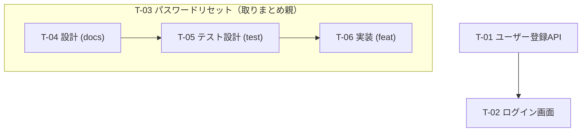

> `/plan-to-issues` のフェーズ3で使う作業計画 doc の固定書式。全体フロー・承認ゲートは `../SKILL.md` を参照。

# 作業計画 doc のテンプレート

出力先: `docs/internal/tasks/issue-plan.md`（複数運用時はユーザー指定で `issue-plan-<name>.md`）。

**この構造（見出し・表の列）は変えずに使う。** 起票結果（issue#・node-id）を後から書き戻す真理ソースになるため、列を勝手に増減しない。以下の `<...>` を埋める。

---

````markdown
# 作業計画: <プロジェクト/対象名>

## メタ情報
- 入力: <入力ドキュメントのパスを列挙>
- 入力ステージ: <A: 要件定義書のみ / B: 基本設計書あり>
- 粒度プロファイル: <feature / layered>
- モード: <dry-run / auto / headless>
- 作成日: <YYYY-MM-DD（分かる場合。不明なら空欄）>

## タスク一覧
| task-id | タイトル | type | テンプレ | 根拠ID | 親(task-id) | blocked-by(task-id) | 優先度 | DoD要約 | issue# | node-id |
| --- | --- | --- | --- | --- | --- | --- | --- | --- | --- | --- |
| T-01 | ユーザー登録APIの実装 | feat | feat.md | FR-03,R-01 | — | — | high | 登録/入力検証/永続化/エラー応答 | | |
| T-02 | ログイン画面の実装 | feat | feat.md | UI-02,FR-04 | — | T-01 | mid | 画面表示/認証連携/失敗時表示 | | |
| T-03 | パスワードリセット機能（取りまとめ） | feat | feat.md | FR-06,FR-07 | — | — | mid | 子3件の完了で達成（取りまとめ親・作業ステップではない） | | |
| T-04 | パスワードリセットの設計 | docs | spec.md | FR-06,FR-07 | T-03 | — | mid | フロー/API仕様/メール文面の確定 | | |
| T-05 | パスワードリセットのテスト設計 | test | test-design.md | FR-06,FR-07 | T-03 | T-04 | mid | AC抽出/it.todo雛形/異常系観点 | | |
| T-06 | パスワードリセットの実装 | feat | feat.md | FR-06,FR-07 | T-03 | T-05 | mid | トークン発行/検証/更新/失効 | | |

- `issue#` / `node-id` 列は起票フェーズ（フェーズ5）で埋める。起票前は空。
- 空の `issue#` を持つ行のみが再実行時の起票対象（冪等の真理ソース）。

## 依存グラフ



- **親子は subgraph、blocked-by は矢印で表現する。** 取りまとめ親（T-03）は子を囲む箱として描き、**親から子への矢印（blocked-by）は引かない**。blocked-by の矢印は子同士（T-04→T-05→T-06）だけ。
- 循環がないことを確認する。

## カバレッジ表（要件ID → task-id）

| 根拠ID | 対応 task-id | 備考 |
| --- | --- | --- |
| FR-03 | T-01 | |
| FR-04 | T-02 | |
| UI-02 | T-02 | |
| FR-06 | T-04, T-05, T-06 | 取りまとめ親 T-03 が束ねる（設計/テスト設計/実装） |
| FR-07 | T-04, T-05, T-06 | 同上 |
| NFR-05 | （未 issue 化） | 運用で対応するため今回は起票しない |

- **全根拠IDを1行ずつ列挙する。** 対応 task-id が空の ID は「未 issue 化」とし、**理由を必ず書く**（漏れと意図的除外を区別する）。
- 取りまとめ親（例: T-03）は子の 根拠ID を束ねる箱なので、カバレッジ表では **根拠ID を子 task-id に対応づける**（親を単独で列挙しなくてよい）。

## backlog.md 追記プレビュー

起票後に `docs/internal/tasks/backlog.md` へ追記する行のプレビュー（既存列 `ID / Task / Feature / Priority / Status` に合わせる）。

| ID | Task | Feature | Priority | Status |
| --- | --- | --- | --- | --- |
| T-01 | ユーザー登録APIの実装 | 認証 | high | planned → (起票後) #NN open |

## relationship 配線予定

- 親子（sub-issue）: T-03 ← T-04, T-03 ← T-05, T-03 ← T-06 （取りまとめ親 T-03 が 3 子を束ねる）
- blocked-by: T-05 is blocked by T-04, T-06 is blocked by T-05 （子同士のみ）
- 注記: **親 T-03 はどの子とも blocked-by で繋がない**（親子＝構造と blocked-by＝順序を同一ペアに重ねない）。
- （起票後に実 issue 番号で配線。配線済みは末尾に ✅ を付す）

````

---

## 記入のルール

- タスク表とカバレッジ表は必ず両方書く。カバレッジ表が「全ID列挙＋未起票理由」の唯一の証跡になる。
- 起票フェーズでは `issue#` と `node-id` を**行ごとに逐次**書き戻す（途中失敗しても再開できるように）。
- headless でもこの doc は必ず生成・保存する。
