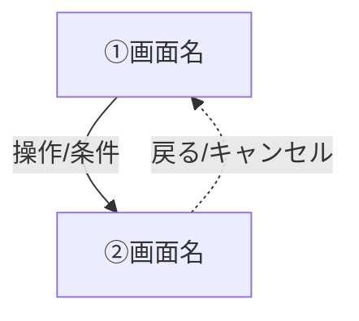
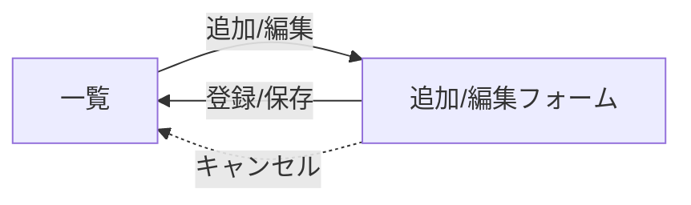
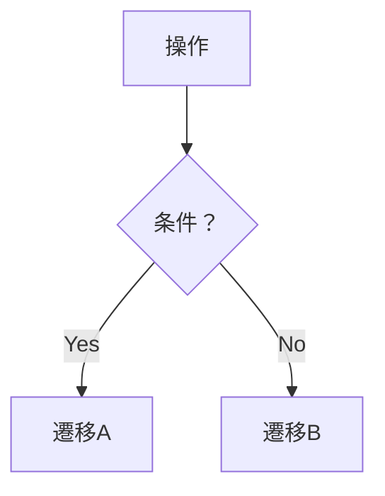

# 画面遷移図・遷移一覧

## 出力ルール

画面遷移図は、Phase 1（要件定義）で要件定義書最終版の作成後に、本ファイルの構成に従ってドラフトとして自動生成する。

| 種別 | 出力先 | 用途 |
| --- | --- | --- |
| 画面遷移図ドラフト | `docs/internal/requirements-definition-draft/screen-flow.md` | Phase 2（外部設計）の UI デザイン工程 `/design-ui` の入力（たたき台）。確定はそちらで行う。 |

- 入力は、要件定義書の画面要件（UI-xxx）・業務フロー・機能仕様とする。
- 画面遷移図は Phase 1 ではドラフト扱いとし、Phase 2 の UI デザイン工程を経て確定する。
- 章立て・見出し名・表形式は原則として維持する。
- 該当する遷移パターンがない章（内部遷移・条件分岐など）は、省略してよい。

---

# 画面遷移図

> Phase 1（要件定義）で自動生成するドラフト。Phase 2（外部設計）の UI デザイン工程で確定する。
> 要件定義書の画面要件（UI-xxx）・業務フロー・機能仕様をもとに作成。

## 全体フロー（Mermaid）

全画面の主要な遷移を `flowchart TD` で記述する。矢印のラベルには操作・条件を記載する。

## 画面内部の遷移（共通パターンがある場合）

一覧→フォーム→戻る のような繰り返しパターンがある場合は、別図で整理する。共通パターンがなければ省略してよい。

## 主要な条件分岐（分岐が複雑な画面がある場合）

バリデーション・確認ダイアログなどの分岐が複雑な画面は、`flowchart TD` で条件分岐を整理する。該当がなければ省略してよい。

## 遷移一覧

| 遷移元 | 操作 | 遷移先 | 条件 |
| --- | --- | --- | --- |

## 確定事項（Phase 2 UI デザイン工程で承認後に記載）

Phase 1 では空欄でよい。Phase 2 のヒアリングで確定した遷移方針を記載する。
